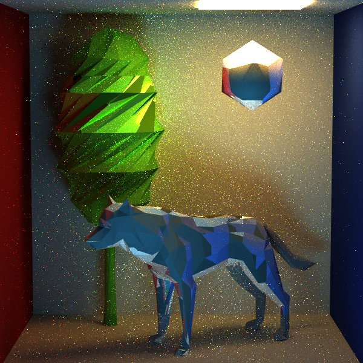

Path Tracer Episode VI: Return of the Acceleration Structures
======================

Sarah Forcier 
58131867

Cornell Box
-------------
Rendered with 100 samples per pixel

| Full BVH | Direct BVH | Naive BVH |
| -----------| ---------- | ------- |
|  |  | |

| Full | Direct | Naive |
| -----------| ---------- | ------- |
|  |  | |

BVH Build Time: 0 milliseconds

| Integrator | BVH Render | without | speedup |
| -----------| ---------- | ------- | ------- |
| Full 		 | 429401 | 569307 | 1.33 |
| Direct 	 | 83374 | 117069 | 1.40 |
| Naive 	 | 175994 | 256472 | 1.46 |

Mario Box
--------------
| With BVH | Without |
| -----------| ---------- |
|  |  |

Direct Lighting
BVH Build Time: 51 milliseconds
Rendered with 4 samples per pixel
5172 triangles

| Integrator | BVH Render | without | speedup |
| -----------| ---------- | ------- | -------
| Direct 	 | 6097 |  1174644 | 193

Wolf with a Tree
-----------
Full Lighting
BVH Build Time: 26 milliseconds
Render Time: 6674968 milliseconds
Rendered with 900 samples per pixel
1376 triangles
600x600 resolution 

Blooper
-----------
